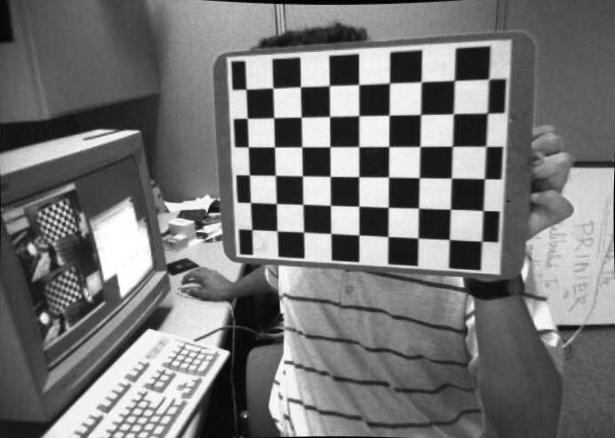
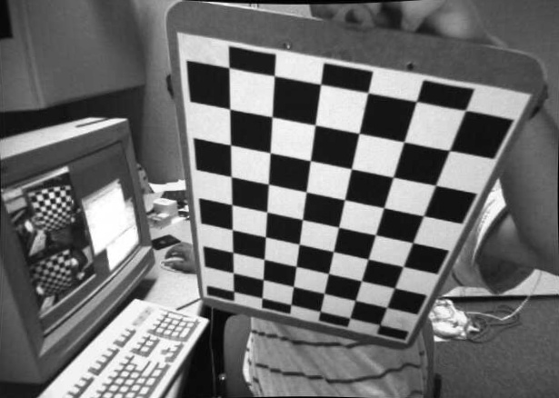
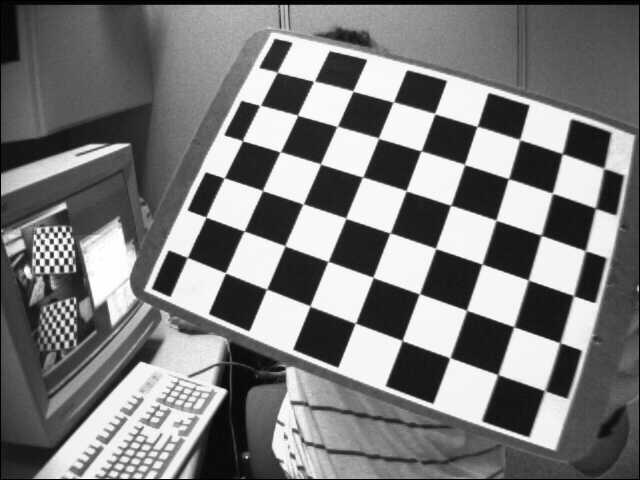
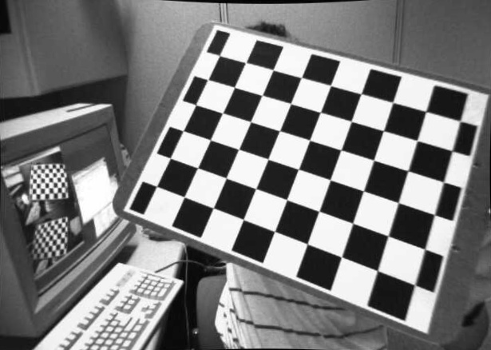
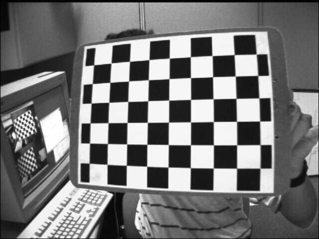
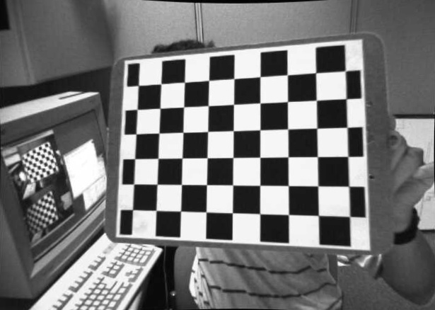

# Camera Calibration
## Introduction
Today’s cheap pinhole cameras introduces a lot of distortion to images. Two major distortions are radial distortion and tangential distortion.

Due to radial distortion, straight lines will appear curved. Its effect is more as we move away from the center of image. 

## Usage and File Hierarchy
    .
    ├── assets                  # Pictures used for Calibration                  
    |    └── left01.jpg
    |    └── left02.jpg
    |    ...
    |    └── left14.jpg
    ├── my_dataset              # Manually collected dataset     
    │    └── WIN_20190829_19_27_01_Pro.jpg
    │    └── WIN_20190829_19_27_04_Pro.jpg
    │    ...
    │    └── WIN_20190829_19_27_37_Pro.jpg
    ├── outputs                 # Processed Version of assets images         
    |    └── left01.jpg
    |    └── left02.jpg
    |    ...
    |    └── left14.jpg
    ├── create_test_video.py    # Create video from assets                   
    ├── final_video.py          # Calibration on Video          
    ├── pic_slides.avi          # Created Video
    ├── reprojection_error.py   # Calcualation of errors
    ├── setup.py                # Create initial image and object points
    ├── undistortion.py         # Calibration on Image with all params
    └── README.md

## Camera Matrix
Intrinsic parameters are specific to a camera. It includes information like focal length $(f_x,f_y)$, optical centers $(c_x, c_y)$ etc. It is also called camera matrix. It depends on the camera only, so once calculated, it can be stored for future purposes. It is expressed as a 3x3 matrix

## Code
### Data
The sample images are taken from OpenCVs official repo [Here](https://github.com/opencv/opencv/tree/master/samples/data).

Important input datas needed for camera calibration is a set of 3D real world points and its corresponding 2D image points.
3D points are called object points and 2D image points are called image points.
### Algorithm
* setup.py
  * So to find pattern in chess board, we use the function `cv2.findChessboardCorners()`. 
  * Once we find the corners, we can increase their accuracy using `cv2.cornerSubPix()`. 
  * We can also draw the pattern using `cv2.drawChessboardCorners()`.
* undistortion.py
  * So now we have our object points and image points we are ready to go for calibration. For that we use the function, `cv2.calibrateCamera()` . It returns the camera matrix, distortion coefficients, rotation and translation vectors etc.
  * We can refine the camera matrix based on a free scaling parameter using `cv2.getOptimalNewCameraMatrix()`.
  * Now, the `cv2.undistort()` function is used to find the shortest path and then use ROI to crop our result
* reprojection_error.py
  * Re-projection error gives a good estimation of just how exact is the found parameters. This should be as close to zero as possible. 
  * Given the intrinsic, distortion, rotation and translation matrices, we first transform the object point to image point using `cv2.projectPoints()`.

# Results

  
   

  
   

  
   

  
   

